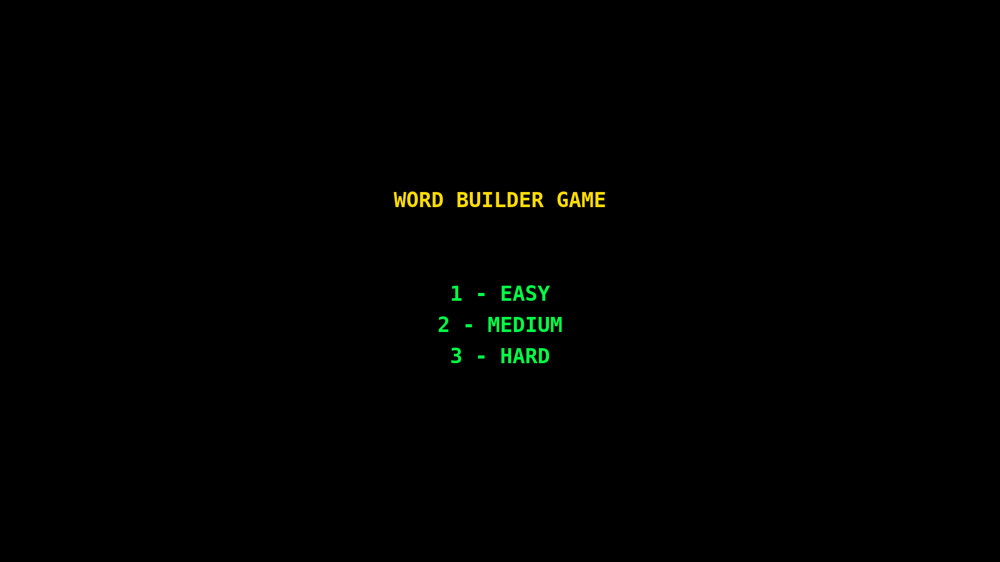
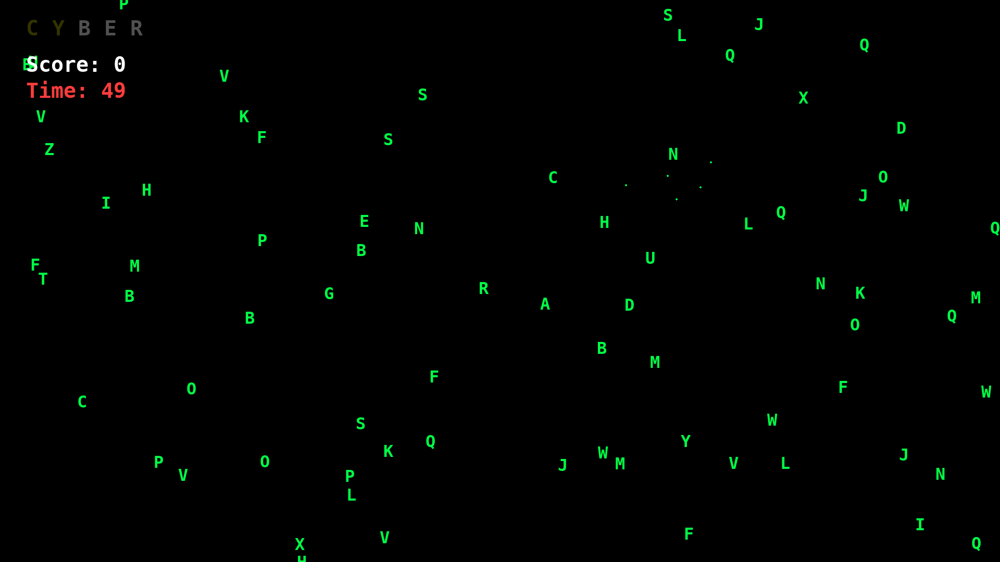
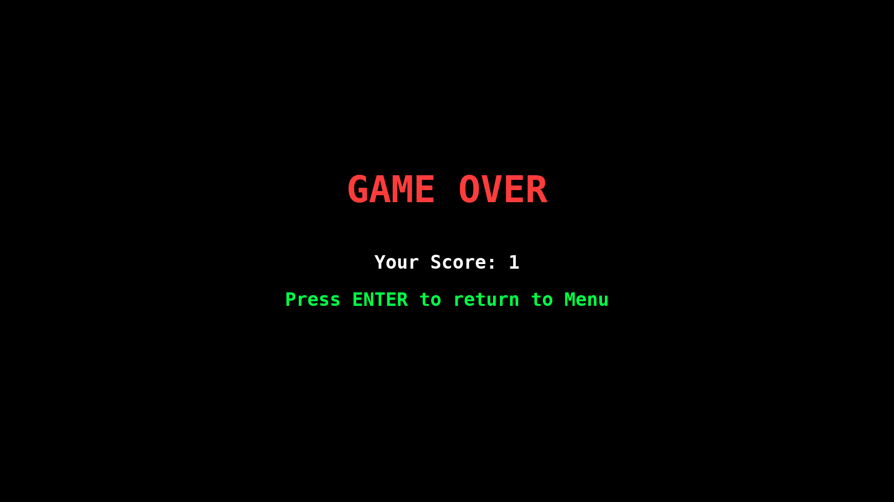

# Word Builder Game

A fast-paced typing and reaction game built with Pygame where you catch falling letters to spell words before time runs out!



## 🎮 About

Word Builder is an arcade-style game that combines quick reflexes with spelling skills. Letters rain down from the top of the screen in Matrix-style fashion, and you must click on them in the correct order to spell target words. Complete words to earn points and bonus time!

## ✨ Features

- **Three Difficulty Levels**
  - 🟢 Easy: Slower letters, more time bonus
  - 🟡 Medium: Moderate speed and time bonus
  - 🔴 Hard: Fast-paced action for experienced players

- **Dynamic Gameplay**
  - Falling letter matrix effect
  - Real-time word progress tracking
  - Particle explosion effects on letter clicks
  - Glowing animations for completed letters
  - Time bonus system rewards longer words

- **Customizable Word Lists**
  - Load custom words from text file
  - Fallback to built-in word list
  - Case-insensitive matching

- **Fullscreen Experience**
  - Immersive fullscreen gameplay
  - Retro terminal aesthetic with Consolas font
  - Smooth 60 FPS animations

## 🎯 Gameplay



1. **Select Difficulty**: Choose Easy (1), Medium (2), or Hard (3)
2. **Watch the Target**: The word you need to spell appears at the top
3. **Click Letters**: Click falling letters in the correct order
4. **Complete Words**: Finish the word to score points and gain bonus time
5. **Beat the Clock**: Keep playing until time runs out!

### Scoring System

- **+1 point** per completed word
- **Bonus time** based on difficulty and word length:
  - Easy: +5 seconds × word length
  - Medium: +4 seconds × word length  
  - Hard: +3 seconds × word length

## 🚀 Installation

### Prerequisites

- Python 3.7 or higher
- pip (Python package manager)

### Step 1: Clone the Repository

```bash
git clone https://github.com/Aerex0/Word_Builder.git
cd Word_Builder
```

### Step 2: Create Virtual Environment (Recommended)

**On Linux/Mac:**
```bash
python3 -m venv venv
source venv/bin/activate
```

**On Windows:**
```bash
python -m venv venv
venv\Scripts\activate
```

### Step 3: Install Dependencies

```bash
pip install -r requirements.txt
```

This will install:
- `pygame` - Game engine and graphics library

### Step 4: Run the Game

```bash
python Word_Builder.py
```

Or on some systems:
```bash
python3 Word_Builder.py
```

## 📁 File Structure

```
Word_Builder/
├── Word_Builder.py                # Main game file
├── Word_Builder_Wordlists.txt     # Custom word list (one word per line)
├── requirements.txt               # Python dependencies
├── README.md                      # This file
├── Screenshots/                   # Game screenshots
│   ├── Menu.png
│   ├── GamePlay.png
│   └── game_over.png
└── venv/                          # Virtual environment (not in repo)
```

## 🎨 Customization

### Adding Custom Words

Edit `Word_Builder_Wordlists.txt` to add your own words:

```text
PYTHON
MATRIX
HACKER
CYBERPUNK
TERMINAL
```

**Rules:**
- One word per line
- Words will be converted to uppercase automatically
- Empty lines are ignored
- If file is missing, the game uses a built-in word list

### Modifying Game Settings

Open `Word_Builder.py` and adjust these constants:

```python
# Starting time (seconds)
TIME_LIMIT = 60

# Bonus time per word
BONUS_TIME = {
    "easy": 5,
    "medium": 4,
    "hard": 3
}

# Difficulty settings
DIFFICULTY_SETTINGS = {
    "easy": {"min_speed": 1, "max_speed": 4, "count": 80},
    "medium": {"min_speed": 2, "max_speed": 6, "count": 120},
    "hard": {"min_speed": 3, "max_speed": 8, "count": 160},
}
```

### Customizing Colors

```python
WHITE = (255, 255, 255)
GREEN = (0, 255, 70)      # Matrix green
RED = (255, 60, 60)
BLACK = (0, 0, 0)
YELLOW = (255, 220, 0)
```

## 🎮 Controls

| Key/Action | Function |
|------------|----------|
| **1** | Start Easy difficulty |
| **2** | Start Medium difficulty |
| **3** | Start Hard difficulty |
| **Left Click** | Catch falling letters |
| **ENTER** | Return to menu (after game over) |
| **ESC** | Quit game |

## 📸 Screenshots

### Main Menu


### Gameplay


### Game Over


## 🐛 Troubleshooting

### "pygame not found" Error

```bash
pip install pygame
```

Or if using virtual environment:
```bash
source venv/bin/activate  # On Linux/Mac
venv\Scripts\activate     # On Windows
pip install pygame
```

### "Word_Builder_Wordlists.txt not found" Warning

The game will work fine with the built-in word list. To use custom words:
1. Create `Word_Builder_Wordlists.txt` in the same directory as the game
2. Add one word per line
3. Run the game again

### Game Runs Too Slow

- Close other applications
- Try lowering the screen resolution
- Update your graphics drivers
- Ensure pygame is properly installed: `pip install --upgrade pygame`

### Fullscreen Issues

If fullscreen doesn't work on your system, you can modify the code to use windowed mode:

```python
# Change this line in Word_Builder.py:
screen = pygame.display.set_mode((1280, 720))  # Windowed mode
```

### Letters Not Appearing

Make sure your terminal font (Consolas) is available. If not, change the font:

```python
FONT = pygame.font.SysFont("arial", FONT_SIZE, bold=True)
```

## 🛠️ Technical Details

### Built With

- **Python 3.x** - Core programming language
- **Pygame** - Game framework and graphics rendering
- **Random** - Procedural generation of letters and positions
- **Math** - Glow effect animations

### Game Architecture

- **State Machine**: Menu → Game → Game Over
- **Object-Oriented Design**: `FallingChar` and `Particle` classes
- **Event-Driven**: Mouse and keyboard input handling
- **Delta Time**: Frame-independent timing for smooth gameplay

### Performance

- **Target FPS**: 60
- **Letter Count**: 80-160 (based on difficulty)
- **Particle Effects**: 20 particles per click
- **Screen**: Dynamic fullscreen resolution

## 🤝 Contributing

Contributions are welcome! Here's how you can help:

1. **Fork the repository**
2. **Create a feature branch**
   ```bash
   git checkout -b feature/amazing-feature
   ```
3. **Commit your changes**
   ```bash
   git commit -m "Add amazing feature"
   ```
4. **Push to the branch**
   ```bash
   git push origin feature/amazing-feature
   ```
5. **Open a Pull Request**

### Ideas for Contributions

- [ ] Add sound effects and background music
- [ ] Implement high score system with local storage
- [ ] Add power-ups (freeze time, slow letters, etc.)
- [ ] Create themed word packs (coding, science, etc.)
- [ ] Add multiplayer mode
- [ ] Implement progressive difficulty scaling
- [ ] Add keyboard typing mode as alternative to mouse
- [ ] Create level progression system

## 📜 License

This project is licensed under the MIT License - see the [LICENSE](LICENSE) file for details.

## 👤 Author

**Suyash Ranjan (Aerex)**

- GitHub: [@Aerex0](https://github.com/Aerex0)
- Game: [Word Builder](https://github.com/Aerex0/Word_Builder)

## 🙏 Acknowledgments

- Inspired by classic Matrix falling code aesthetic
- Built with [Pygame](https://www.pygame.org/) community tutorials
- Thanks to all testers and contributors

## 📝 Changelog

### Version 1.0.0 (Current)
- Initial release
- Three difficulty modes
- Custom word list support
- Particle effects
- Fullscreen gameplay
- Time bonus system

---

**Enjoy the game!** If you like it, please ⭐ star the repository and share it with friends!

## 🎯 Tips & Strategies

1. **Start with Easy** - Learn the mechanics before jumping to harder difficulties
2. **Plan Ahead** - Watch where the next letter is while clicking current ones
3. **Longer Words = More Time** - The bonus time scales with word length
4. **Stay Calm** - Panic clicking will make you miss the correct letters
5. **Practice Letter Recognition** - The better you know the keyboard layout, the faster you'll spot letters

Happy spelling! 🎮✨